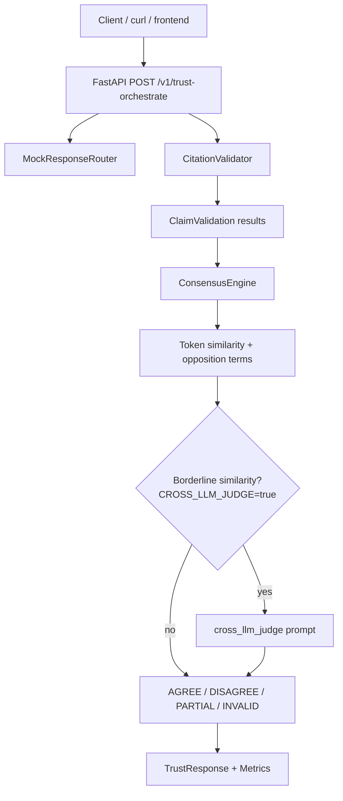

# Multi-Model Trust

Multi-Model Trust compares answers from two or more models on the same prompt. It validates citations, groups related claims, labels agreement or disagreement, and returns a structured trust report with metrics.

Repository: https://github.com/tejasvi-mehra/multi-model-trust

## What The Service Does

The API answers:

```text
Given several model responses to the same prompt, where do they agree,
where do they disagree, and are their citations valid?
```

The caller sends one prompt, two or more model responses, and for each claim optional citations (`url` + exact `quote`).

The service returns citation validation results, consensus groups, labels (`AGREE`, `DISAGREE`, `PARTIAL`, `INVALID`), and metrics including citation precision, support scores, and group counts.

### Label meanings

| Label | Meaning |
| --- | --- |
| `AGREE` | Multiple models made materially similar claims without detected contradiction |
| `DISAGREE` | Similar claims contain opposition signals (e.g. suitable vs not suitable) |
| `PARTIAL` | Only one validly cited model made the claim, or overlap among valid claims was too weak |
| `INVALID` | All related claims have missing, incorrect, or unreachable citations |

When at least one model has valid citations, invalid or unreachable claims are excluded from similarity checks and listed under `invalidated_members`.

### Citation validation

| Status | Meaning |
| --- | --- |
| `VALID` | All citations fetched and every quote found in source text |
| `INVALID` | Source fetched but one or more quotes not found |
| `UNREACHABLE` | Source URL could not be fetched (`reason`: `source not reachable`) |
| `MISSING` | No citation attached to the claim |

Each citation includes a `support_score` (0–1): token overlap between the claim statement and the quoted text.

## End-to-end flow

```text
POST /v1/trust-orchestrate
  -> validate request (2+ distinct models)
  -> route caller-supplied responses
  -> fetch citation URLs concurrently
  -> verify quotes + compute support scores
  -> group claims by similarity and opposition
  -> optionally attach borderline cross-LLM judge prompt
  -> return TrustResponse + metrics + JSON logs
```

## Consensus logic

Consensus runs after citation validation and only compares claims with `VALID` citations.

**1. Build members.** Each model claim becomes a `ConsensusMember` with citation status and any citation errors.

**2. Group valid claims.** For each valid claim, compare its statement to existing group members using Jaccard token overlap (stopwords removed). Two claims join the same group when:

- token similarity ≥ `CONSENSUS_SIMILARITY_THRESHOLD`, or
- opposition is detected (negation mismatch on similar claims, or configured opposing term pairs such as `suitable|not suitable`), or
- cross-LLM judge is enabled, similarity is in the borderline band, threshold/opposition did not already decide, and the simulated judge returns `AGREE` or `DISAGREE`

**3. Attach invalidated claims.** Claims with bad or unreachable citations are linked to a valid group when they are loosely related (using `CONSENSUS_OPPOSITION_SIMILARITY_THRESHOLD`). They are stored in `invalidated_members` and excluded from the similarity comparison that drives the label.

**4. Label each group.**

- `DISAGREE` if any pair in the group has opposition, or the borderline judge decision is `DISAGREE`
- `AGREE` if multiple distinct models are in the group and there is no disagreement
- `PARTIAL` if only one model remains in the group after citation filtering, or one valid model was prioritized over invalidated members
- `INVALID` if no valid members remain (only invalidated claims)

**5. Cross-LLM judge.** When `CROSS_LLM_JUDGE=true`, a sample judge prompt is attached only for borderline valid-citation pairs where normal threshold and opposition checks did not already resolve grouping. Invalid-only groups never receive a judge prompt.

For `samples/llm_judge_request.json`, also set `CONSENSUS_SIMILARITY_THRESHOLD=0.9` so similarity falls in the borderline band below the normal grouping threshold.

## Project structure

```text
.
├── config.py                          settings + consensus engine factory
├── main.py                            FastAPI app and orchestration endpoint
├── internal/
│   ├── framework/
│   │   ├── logger.py                  structured logging helpers
│   │   └── runner.py                  bounded async concurrency
│   └── service/
│       ├── schemas.py                 Pydantic request/response models
│       ├── router.py                  response routing interface
│       ├── validator.py               citation fetch + validation
│       └── consensus.py               claim grouping and labeling
├── samples/                           request payloads + expected summaries
├── tests/
│   ├── fixtures/pages/                prefetched HTML for offline tests
│   ├── unit/
│   └── evaluation/
├── scripts/refresh_prefetched_pages.py
├── openapi.yaml                       full API specification
├── .env.example                       configuration template
├── .github/workflows/pr-tests.yml   CI pipeline
├── Dockerfile
├── docker-compose.yml
├── Makefile
└── requirements.txt
```

The application intentionally contains **eight Python source files** under `config.py`, `main.py`, and `internal/`. Tests, samples, and tooling are separate.

## Eight Python files — logic breakdown

### `config.py`

Loads runtime settings from environment variables (and `.env` when present). Parses consensus stopwords, opposing term pairs, citation limits, and cross-LLM judge options. Exposes `load_settings()` and `build_consensus_engine()` so the API can rebuild the consensus engine on every request without restarting the process.

### `main.py`

FastAPI entrypoint. Wires the logger, mock response router, HTTP citation validator, and per-request consensus engine. Implements `GET /healthz` and `POST /v1/trust-orchestrate`: validates model count, routes responses, validates citations, builds consensus, aggregates metrics, emits JSON trace logs, and returns `TrustResponse`.

### `internal/framework/logger.py`

Generic logging utilities. `build_logger()` creates a reusable stream logger; `log_json()` writes one structured JSON line per pipeline event (orchestration start/complete, consensus comparisons, group decisions).

### `internal/framework/runner.py`

Generic async helper. `map_bounded()` runs an async worker over a list with a concurrency limit while preserving result order. Used by the citation validator to fetch many URLs in parallel without unbounded fan-out.

### `internal/service/schemas.py`

Pydantic models for the API boundary: `TrustRequest`, `TrustResponse`, claims, citations, validation results, consensus groups, cross-LLM judge payload, and metrics. Enforces distinct model names and field constraints at parse time.

### `internal/service/router.py`

Defines the `ResponseRouter` protocol and `MockResponseRouter`, which passes through caller-supplied responses. Includes a commented example sketch for a future provider-backed router.

### `internal/service/validator.py`

Citation pipeline. Defines the `UrlFetcher` protocol and `HttpxUrlFetcher` (with configurable `User-Agent`). Fetches each citation URL, normalizes page text, checks quote presence, assigns `support_score`, and rolls up claim-level status (`VALID`, `INVALID`, `UNREACHABLE`, `MISSING`). Exports metric helpers: `citation_precision`, `average_citation_support_score`, `unreachable_citation_count`.

### `internal/service/consensus.py`

Trust comparison engine. Tokenizes claims, computes Jaccard similarity, detects negation and configured opposition pairs, groups valid claims, links invalidated members, optionally attaches a borderline cross-LLM judge prompt, and assigns final group labels with structured logging at each comparison step.

## API specification

| Resource | Location |
| --- | --- |
| OpenAPI YAML (full contract) | [`openapi.yaml`](openapi.yaml) · [view on GitHub](https://github.com/tejasvi-mehra/multi-model-trust/blob/main/openapi.yaml) |
| Interactive docs (server running) | `http://localhost:8000/docs` |
| Health check | `GET /healthz` |
| Orchestration | `POST /v1/trust-orchestrate` |

Example request:

```json
{
  "prompt": "Should a small backend team use Python and FastAPI for an API?",
  "responses": [
    {
      "model": "mock-alpha",
      "claims": [
        {
          "statement": "Python is suitable for backend APIs because it is high-level.",
          "citations": [
            {
              "url": "https://www.python.org/doc/essays/blurb/",
              "quote": "Python is an interpreted, object-oriented, high-level programming language with dynamic semantics."
            }
          ]
        }
      ]
    },
    {
      "model": "mock-beta",
      "claims": [
        {
          "statement": "Python is not suitable for backend APIs when raw runtime speed is the top priority.",
          "citations": [
            {
              "url": "https://www.python.org/doc/essays/blurb/",
              "quote": "Python is an interpreted, object-oriented, high-level programming language with dynamic semantics."
            }
          ]
        }
      ]
    }
  ]
}
```

## Configuration

Copy `.env.example` to `.env`. `make run` loads it via `python-dotenv`. Quote values that contain spaces or pipes.

| Variable | Purpose |
| --- | --- |
| `SERVICE_NAME`, `LOG_LEVEL` | Logger identity and verbosity |
| `CITATION_TIMEOUT_SECONDS` | HTTP timeout for citation fetches |
| `MAX_CITATION_CONCURRENCY` | Parallel citation fetch limit |
| `MIN_MODEL_RESPONSES` | Minimum models required per request |
| `CITATION_USER_AGENT` | User-Agent header sent when fetching citations |
| `CONSENSUS_SIMILARITY_THRESHOLD` | Token overlap needed to group agreeing claims |
| `CONSENSUS_OPPOSITION_SIMILARITY_THRESHOLD` | Overlap needed before negation counts as opposition |
| `CONSENSUS_STOPWORDS` | Comma-separated words ignored during similarity |
| `CONSENSUS_OPPOSING_TERMS` | Comma-separated `positive\|negative` pairs for contradiction checks |
| `CROSS_LLM_JUDGE` | Enable borderline judge prompt emission |
| `CROSS_LLM_JUDGE_MODEL_NAME` | Label shown on the judge prompt object |
| `CROSS_LLM_JUDGE_BORDERLINE_LOW` / `HIGH` | Similarity band that triggers the judge |

The consensus engine is rebuilt from env on every request through `config.build_consensus_engine()`.

## Local build and run

```bash
python -m venv .venv
source .venv/bin/activate
make install
cp .env.example .env
make run
```

Try sample payloads:

```bash
curl -X POST http://localhost:8000/v1/trust-orchestrate \
  -H "Content-Type: application/json" \
  --data @samples/agreement_request.json
```

Samples under `samples/` cover agreement, disagreement, mixed opinion, partial invalid citations, all-invalid citations, a large mixed payload, and a borderline judge case. Citation URLs and quotes are documented in `samples/sources.md`.

Judge sample — set in `.env`:

```text
CROSS_LLM_JUDGE=true
CONSENSUS_SIMILARITY_THRESHOLD=0.9
```

Then POST `samples/llm_judge_request.json`.

## Tests

```bash
make test          # all tests
make test-unit     # tests/unit
make test-eval     # tests/evaluation
```

Unit tests cover API behavior, schemas, routing, validation, consensus, config, logging, and async helpers.

Evaluation tests load sample JSON and assert expected labels and metrics. Citation pages are read from `tests/fixtures/pages` via `PrefetchedPageFetcher`, so tests stay offline while using the same URLs as the samples. Refresh snapshots with:

```bash
python scripts/refresh_prefetched_pages.py
```

## CI workflow

GitHub Actions workflow: [`.github/workflows/pr-tests.yml`](.github/workflows/pr-tests.yml)

| Trigger | `pull_request`, push to `main` |
| Runner | `ubuntu-latest` |
| Python | 3.12 |
| Steps | checkout → install `requirements.txt` → `pytest -q` |

The pipeline runs the full unit and evaluation test suite on every PR and main-branch push.

## Docker

```bash
make docker-build
make docker-run
# or
docker compose up --build
```

## System diagram



## AI-use disclosure

Claude (via Cursor) assisted with the initial scaffold, service modules, tests, Docker/Makefile artifacts, samples, and documentation. The repository author reviewed consensus behavior (citation filtering, similarity thresholds, borderline judge gating, valid-source prioritization), refreshed prefetched test fixtures, and verified the test suite and sample payloads.
