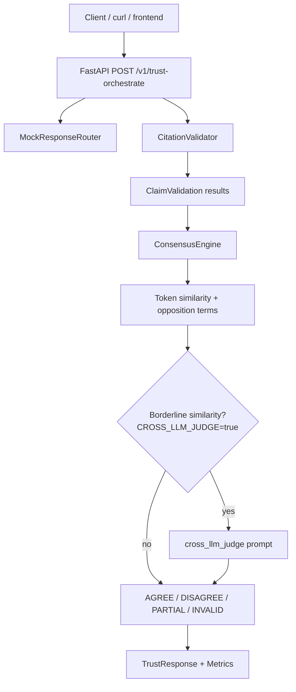

# Multi-Model Trust

Multi-Model Trust compares answers from two or more models on the same prompt. It validates citations, groups related claims, labels agreement or disagreement, and returns a structured trust report with metrics.

For a guided tour, see `WALKTHROUGH.md`.

## What The Service Does

The API answers:

```text
Given several model responses to the same prompt, where do they agree,
where do they disagree, and are their citations valid?
```

The caller sends:

- one prompt
- two or more model response objects
- each model response contains claims
- each claim can include citations with a URL and exact quote

The service returns:

- citation validation results for every claim
- consensus groups across model claims
- labels of `AGREE`, `DISAGREE`, `PARTIAL`, or `INVALID`
- citation precision, support scores, and group counts

## Core Logic

```text
request
  -> route caller-supplied model responses
  -> fetch citation URLs
  -> check whether each quote appears in fetched source text
  -> score claim-to-quote support
  -> group similar claims by token overlap
  -> label grouped claims as AGREE, DISAGREE, PARTIAL, or INVALID
  -> return structured trust report
```

`AGREE` means multiple models made materially similar claims without detected contradiction.

`DISAGREE` means similar claims contain opposition signals, such as one claim saying something is suitable and another saying it is not suitable.

`PARTIAL` means only one validly cited model made the claim, or validly cited claims overlap too weakly to be treated as shared.

`INVALID` means all related model claims have missing, incorrect, or unreachable citations. When at least one model has a valid citation, invalid model claims are excluded from similarity checks and listed under `invalidated_members`.

Citation validation reports:

- `UNREACHABLE` when the source URL could not be fetched
- `INVALID` when the source was fetched but the quote was not found
- `MISSING` when no citation was provided

Each citation includes a `support_score` (0–1) measuring token overlap between the claim statement and the quoted text.

When `CROSS_LLM_JUDGE=true`, borderline comparisons run only when consensus was not already reached by similarity threshold or opposition detection, and only among claims with `VALID` citations. Set `CONSENSUS_SIMILARITY_THRESHOLD=0.9` for `samples/llm_judge_request.json`.

## Project Structure

```text
.
├── config.py
├── main.py
├── internal/
│   ├── framework/
│   │   ├── logger.py
│   │   └── runner.py
│   └── service/
│       ├── schemas.py
│       ├── router.py
│       ├── validator.py
│       └── consensus.py
├── tests/
│   ├── fixtures/pages/          prefetched HTML for offline tests
│   ├── evaluation/
│   └── unit/
├── samples/
└── openapi.yaml
```

Framework utilities live outside business logic. `main.py` wires framework helpers into the service layer and reloads consensus settings from the environment on each request.

## API

```http
POST /v1/trust-orchestrate
GET /healthz
```

Example request:

```json
{
  "prompt": "Should a small backend team use Python and FastAPI for an MVP API?",
  "responses": [
    {
      "model": "mock-alpha",
      "claims": [
        {
          "statement": "Python is suitable for MVP backend APIs because it is high-level.",
          "citations": [
            {
              "url": "https://www.python.org/doc/essays/blurb/",
              "quote": "Python is an interpreted, object-oriented, high-level programming language with dynamic semantics."
            }
          ]
        }
      ]
    },
    {
      "model": "mock-beta",
      "claims": [
        {
          "statement": "Python is not suitable for high-throughput backend APIs when raw runtime speed is the top priority.",
          "citations": [
            {
              "url": "https://www.python.org/doc/essays/blurb/",
              "quote": "Python is an interpreted, object-oriented, high-level programming language with dynamic semantics."
            }
          ]
        }
      ]
    }
  ]
}
```

The maintained OpenAPI contract is in `openapi.yaml`. Interactive docs are at `/docs` when the service is running.

## Local Build And Run

```bash
python -m venv .venv
source .venv/bin/activate
make install
cp .env.example .env
make run
```

Try the sample scenarios:

```bash
curl -X POST http://localhost:8000/v1/trust-orchestrate \
  -H "Content-Type: application/json" \
  --data @samples/agreement_request.json
```

Additional samples cover agreement, disagreement, mixed opinion, partial invalid citations, all-invalid citations, a large mixed payload, and a borderline judge case. See `samples/sources.md` for citation URLs and verified quotes.

For the judge sample, set in `.env`:

```text
CROSS_LLM_JUDGE=true
CONSENSUS_SIMILARITY_THRESHOLD=0.9
```

Then POST `samples/llm_judge_request.json`.

## Configuration

Copy `.env.example` to `.env`. Important variables:

```text
CONSENSUS_SIMILARITY_THRESHOLD=0.35
CONSENSUS_OPPOSITION_SIMILARITY_THRESHOLD=0.35
CONSENSUS_OPPOSING_TERMS=suitable|not suitable,recommended|not recommended,...
CROSS_LLM_JUDGE=false
CROSS_LLM_JUDGE_BORDERLINE_LOW=0.75
CROSS_LLM_JUDGE_BORDERLINE_HIGH=0.85
CITATION_USER_AGENT=multi-model-trust/0.1.0 (+https://github.com/tejasvi-mehra/multi-model-trust)
```

## Tests

```bash
make test
make test-unit
make test-eval
```

Unit tests cover API behavior, schemas, routing, validation, consensus, config, logging, and async helpers.

Evaluation tests load the sample JSON files and assert expected labels, citation metrics, and judge visibility. Citation pages are read from `tests/fixtures/pages` through `PrefetchedPageFetcher`, so tests run offline while still using the same URLs as the samples.

## Docker

```bash
make docker-build
make docker-run
# or
docker compose up --build
```

## System Design


